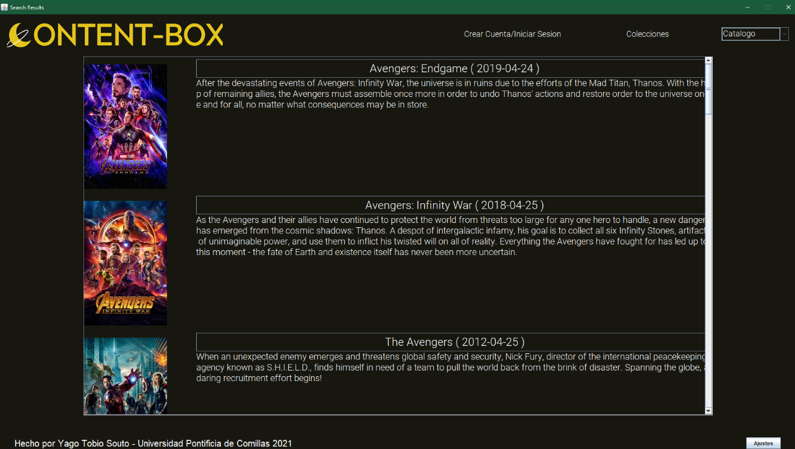
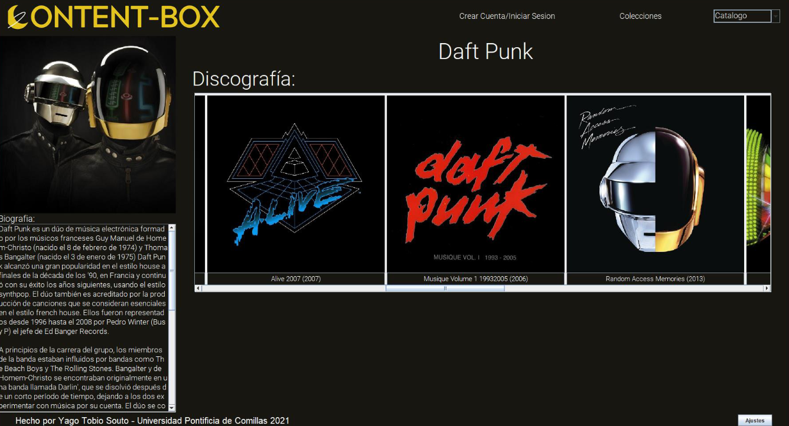
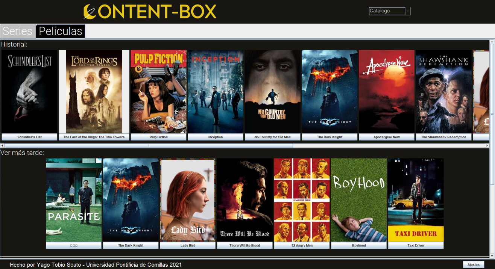

# ContentBox HD

ContentBox HD is an open-source virtual movie log application that integrates with movie database APIs, allowing users to track their favorite movies and TV shows, and explore artist discographies—all within a single app.

## Features

- Create local accounts to manage personal watchlists
- Search and browse movies and TV shows
- Write and store reviews for media content
- View artist discographies and music videos
- Access links to streaming platforms where content is available

## Preview


*Home Screen with media type toggle on the right*


*Movie Search Results*


*Movie Review Functionality and preview. Mark as watched, add to watchlist, or leave a review*


*Search favorite artists and view their discography and music videos*


*Access all logged movies and shows in one place for quick navigation*

## Getting Started

### Prerequisites

- Java Runtime Environment (JRE)

### Installation

1. Clone the repository or download the ContentBox.jar file.
2. Open a terminal and navigate to the directory containing ContentBox.jar.
3. Run the following command:
   ```
   java -jar ContentBox.jar
   ```

## Usage

### Demo Account

To explore the features, you can use the following demo account:
- Username: UsuarioEjemplo
- Password: java2021

## Important Notes

- ContentBox HD is optimized for screens with a 16:9 aspect ratio or larger. Performance on other screen sizes may vary.
- This project was developed as part of a university course on Object-Oriented Programming, showcasing practical application of OOP principles and UI development in Java.

## Contributing

Contributions are welcome! Please feel free to submit a Pull Request.

## Acknowledgements

- [\[Movie Database API\]](https://www.themoviedb.org/)
- Java Swing for UI components
